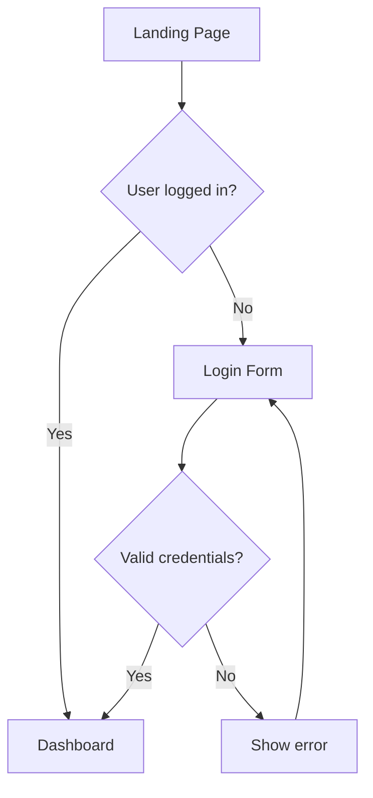

When working on my side projects with LLMs, I noticed a simple pattern that dramatically improved my results. I call it the triangle of success: Me (or any human can go here actually), LLM and text. The idea is straightforward — all these "elements" understand each other and they create a solid, robust construction. Speaking more practically, everything I create should be text-based because text is the language that LLMs understand.

```
      [Human]
       /  \
      /    \
     /      \
 [LLM] ---- [Text]
 ```

---

## The Problem with Traditional Artifacts

Software projects produce many artifacts. Specifications, architecture documents, and code are naturally text-based, so they work well with LLMs out of the box. But what about eg.: UI designs, user flow diagrams or system architecture visualizations? These are traditionally graphical, created in tools like Figma, Miro, or Lucidchart.

Here's the issue: when I hand an LLM a screenshot of my Figma mockup and ask it to implement the UI, the results are inconsistent at best. The model interprets the visual, makes assumptions, and produces something that vaguely resembles what I had in mind. Iterations become painful because each prompt starts from a lossy interpretation of the original design.

---

## Text as the Universal Interface

My solution for that - convert everything to text. Not just for storage or version control, but specifically because text is the interface through which LLMs understand the world.

### Low-Fidelity UI as HTML

I bet that in every company now there is frenzy of pushing AI to facilitate software development as far as possible. In my team, we faced an issue - Figma designs that we get from the UX team are not really well-understood by LLms (We used Figma MCP). AI was making a lot of assumptions, it had difficulties in identifying correct design system components and the results were imprecise.

It all made me think - what if the designs were text-based so LLMs know exactly spacing, layouts, colors and components? I played with the idea a bit and the result was a custom HTML-based low-fidelity design tool. Instead of pixel-perfect mockups in Figma, I describe interfaces using simple HTML structures with utility classes. Something like:

```html
<div class="card">
  <header class="card-header">
    <h2>User Profile</h2>
    <button class="btn-icon">Edit</button>
  </header>
  <div class="card-body">
    
    <div class="user-info">
      <span class="user-name"></span>
      <span class="user-email"></span>
    </div>
  </div>
</div>
```

When I ask an LLM to implement this in React, the result is remarkably close to my intention. There's no interpretation of visual spacing or guessing about component hierarchy — the structure is explicit.

Going even further with this, once I built a set of commonly used class-based components, I started prompting AI to generate the html itself with UI structure draft:

```
LoginPage
- Stack(centeredVericaly, centeredHorizontally)
- - AppLogo
- - EmailInput
- - PasswordInput
- - LoginButton
```

Eventually, the flow became:
- Prompt AI to generate low-fidelity html-based design
- Refine the result
- Ask AI to generate React components from the html spec.

It works fabulously.

### User Flows as Mermaid Diagrams

Next thing I tried was to "textify" user flow charts. The intention wasn't to make AI write code out of it but rather verify and suggest improvements. It worked nicely. Instead of drawing user flows in a visual tool, I describe them using Mermaid.js. An example user login flow becomes:



This is infinitely more useful than a PNG export. I can paste this directly into a prompt and ask the LLM to suggest edge cases I might have missed. The diagram becomes a living specification that the LLM can reason about.


### Vector Graphics as SVG

Yes, graphics can be text-based too. Unlike raster images, SVG files are XML that LLMs understand remarkably well. Here, the results weren't as astonishing as in the previous two examples but I could still profit out of it. LLMs will rather generate very basic SVG shapes that can be also quickly created manually. However, AI understands what a given SVG contains and can combine multiple SVGs into one, eg.: it can compose a more complex graphics out of a house, a tree and a sun.

```xml
<svg viewBox="0 0 24 24" fill="none" stroke="#3b82f6" stroke-width="2">
  <circle cx="12" cy="12" r="10"/>
  <path d="M12 6v6l4 2"/>
</svg>
```

I don't use this technique often in my workflow but I think it is still better to keep graphics as SVG rather than raster images or binary. You can always derive other formats from it.

### Time-Based Content as Code

My "textification" continued. Could time-based content like music or animations be represented as text? I googled a bit and it turned out that there were libraries for creating music-as-code and animation-as-code. If that was a thing then I started thinking if time-based series text representation could be generalized

This led me to draft a general API. The model is built on two primitives:

- **Signals** — continuous states that can be started and stopped
- **Events** — discrete occurrences that can be fired

These primitives are interconvertible. A signal with a start and stop becomes an event. A looped event becomes a signal. Both can be composed to create complex temporal structures.

The composition happens on a timeline in two ways:

- **In sequence** — one after another
- **In parallel** — at the same time

Here's what the notation looks like:

```yaml
Signal1.start()
Event1,
Event2,
Signal1.stop()
[Event3, Event4],  # happen at the same time
Event5,            # starts when both Event3 and Event4 finish

# Conversions
Signal1 = Event1.loop()
Signal2 = [Signal3, Signal4]  # parallel signals
Event1 = Signal1.duration('3s')
```

Whether it's a CSS animation, a video edit timeline, or a musical phrase — they all share this underlying structure. A fade-in is a signal. A drum hit is an event. A song is a composition of both, arranged in sequence and parallel on a timeline.

My experiments are still early, but the results are promising. LLMs can reason about timing, suggest variations, and generate new sequences when the content is represented as text rather than locked in proprietary binary formats.

---

## Artifacts Become Assets

Here's the key insight: when artifacts are text-based, they stop being static documentation and become reusable assets. Each specification, diagram, or UI skeleton can be fed back into the LLM during future iterations.

Need to add a password reset flow? The LLM already understands the existing authentication flow from the Mermaid diagram. A new setting page - The LLM can reference the existing component patterns from HTML specifications.

This creates a compounding effect. The more text-based artifacts are produced, the more context you can provide in future prompts, and the better the LLM performs. Your project documentation becomes a shared language between you and the model.

---

## Summary - Practical Tips

Here are some key takeaways that you may find useful:

1. **Choose text-first tools.** If a tool doesn't export to a text format that preserves meaning, reconsider using it.

2. **Be explicit.** Visual designs rely on implicit conventions. Text specifications should make everything explicit — hierarchy, relationships, states.

3. **Version control everything.** Text artifacts belong in your repository alongside code. They evolve together.

4. **Reference liberally.** When prompting, include relevant specifications. "Implement the dashboard component following the patterns in the attached HTML specification and the user flow from the Mermaid diagram."

Happy "textifying"!
